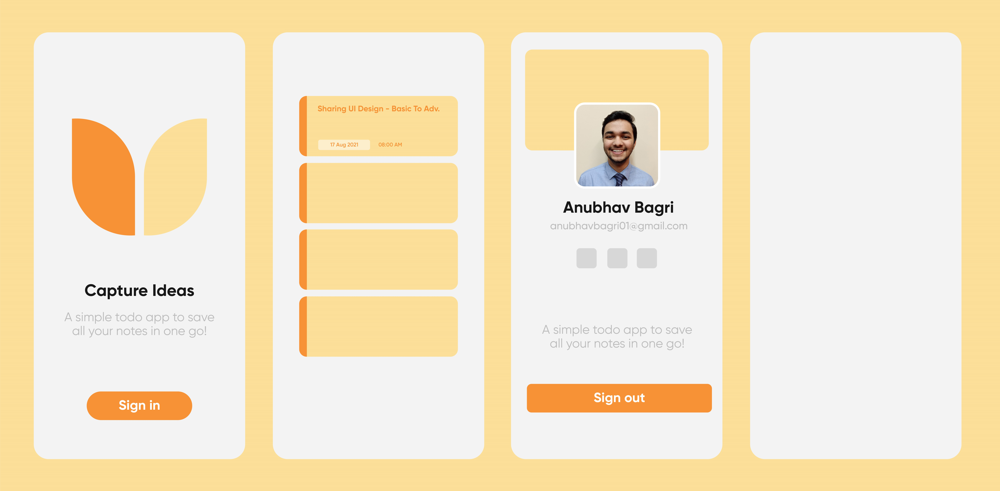
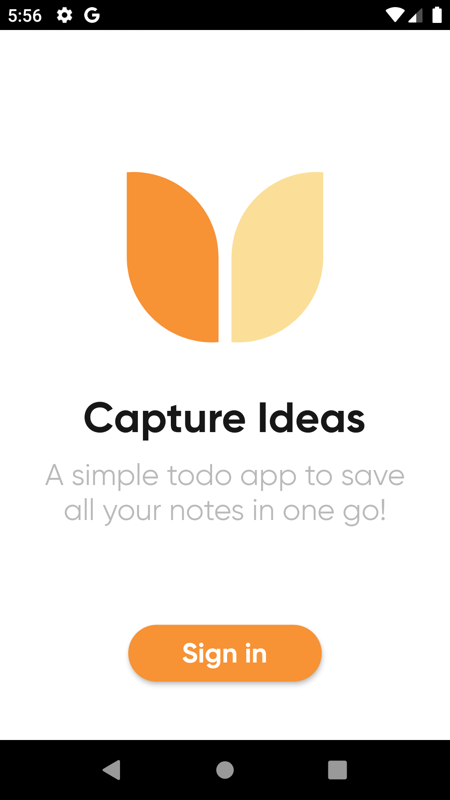
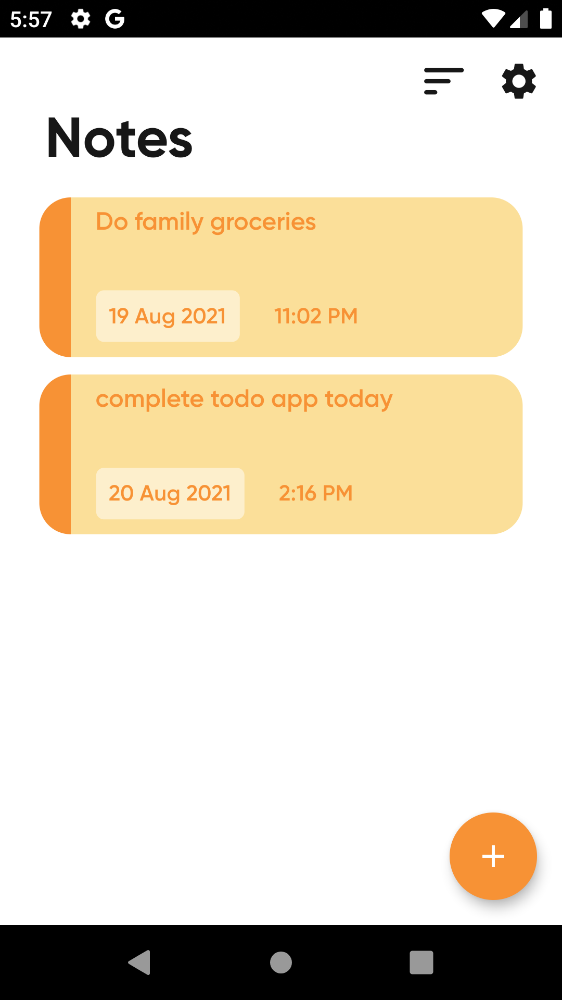
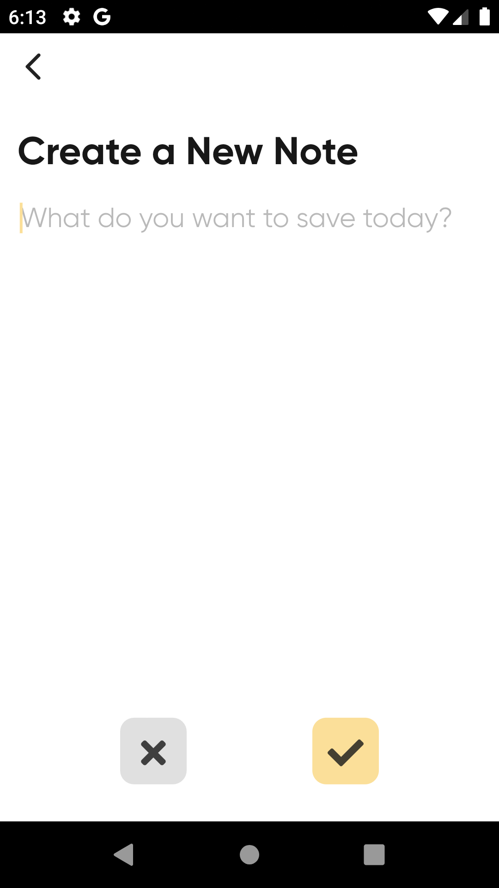
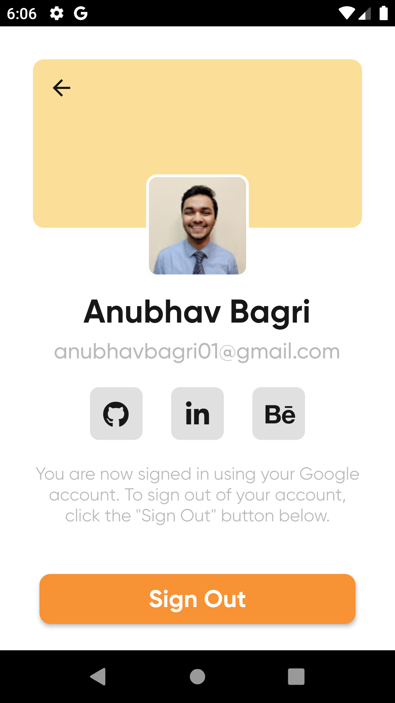
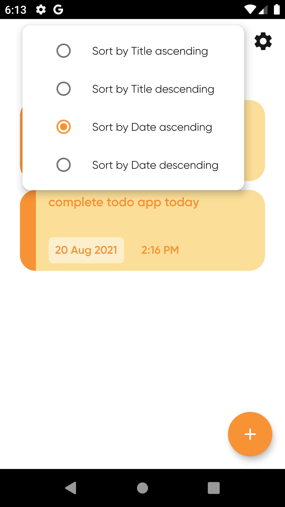
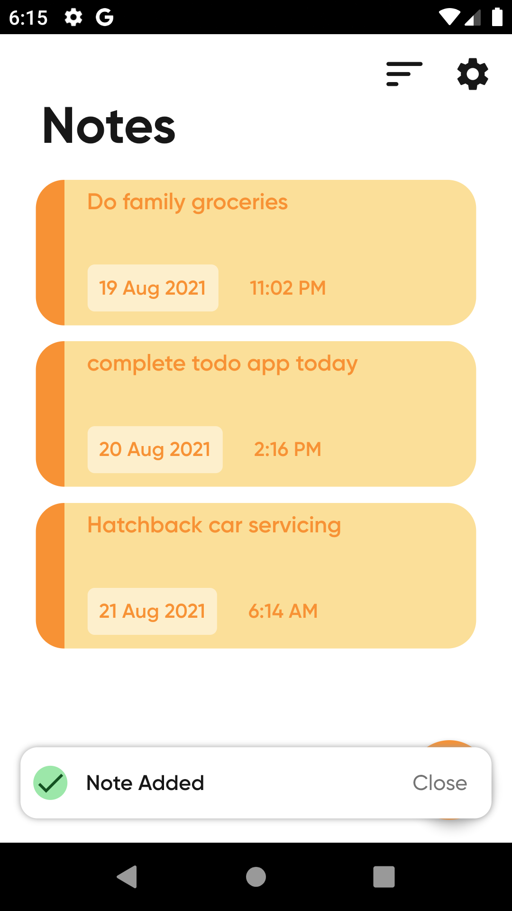

<h2 align="center">Basic To-do app using Flutter and Firebase</h2>

  
 

Simple todo app made using flutter toolkit with the help of firebase to learn how authentication and CRUD operations work!
 
    <a href="https://github.com/anubhavbagri/firebase-rudiments-flutter/releases/tag/v1.0">Get Apk</a>
    ·
    <a href="https://github.com/anubhavbagri/firebase-rudiments-flutter/issues">Report Bug</a>
    ·
    <a href="https://github.com/anubhavbagri/firebase-rudiments-flutter/issues">Request Feature</a>

> Note: Made purely with an intention to practice and learn. Functionality was implemented using [youtube tutorials](https://www.youtube.com/playlist?list=PLrk0JvLjdHgyVlZBiOMjCcszK_h8oXJWn). I designed and revamped the user interface while writing null safe code.

## 🎨 Draft UI design

I made the user interface on Adobe illustrator (not an appropriate software for UI/UX design but I'm quite comfortable in it) while taking inspirations from [Dribbble](https://dribbble.com/)!

## ✍ App summary

- Users can only sign in using their google account credentials
- Once that is successful, they can see the **Notes** page which is initially empty
- They can start adding notes by clicking on the ➕ button in the bottom right corner of the screen
- Added notes would appear in the same page with date and time of its addition
- The note box could be clicked to update the note text
- The note box could be left swiped to dismiss and thus delete it
- The settings button in the top right corner shows the user info screen with a sign out button
- The sort icon button shows a popup menu to sort notes in 4 ways
  - In ascending & descending order of timestamp
  - In ascending & descending order of note text
- A snackbar/toast appears whenever a note is added, updated, deleted or there's a firebase error
- The user info screen has 3 icons squares placed just to fill some empty space

## 💻 How to run?

A few resources to get you started if this is your first Flutter project

 

- [Lab: Write your first Flutter app](https://flutter.dev/docs/get-started/codelab)
- [Cookbook: Useful Flutter samples](https://flutter.dev/docs/cookbook)

For help getting started with Flutter, view our
[online documentation](https://flutter.dev/docs), which offers tutorials,
samples, guidance on mobile development, and a full API reference.

1. Clone this repository in your local machine or download the source code zip
2. Setup a firebase project by following the steps in [this](https://www.youtube.com/watch?v=-4zIP4O89ug) video
3. Get `google-services.json` file and save it in `android/app` directory (for android)
4. You are now equipped to run this app on your android emulator/device

> You're welcome to submit a PR, throw down an issue, or otherwise contribute to the project.

## 🚧 Challenges

I faced a lot of hardships and difficulties while implementing the draft UI and bringing it to life in the actual app. Initially, I had to think about what all features would my application have. Once the idea was clear, I implemented all the logic and backend functionalities. Then, faced some issues thinking about how the final user interface would look like. Thus, prepared a draft design on Adobe illustrator. Finally, implementating it took a while but over time it became simpler since I had learnt the art of googling stuff.

## 🚀 Accomplishments and learnings

- Firebase CRUD operations for flutter
- Designing minimal and aesthetic user interfaces
- Discovering new flutter widgets
- New techniques and workarounds of implementing the design mockup
- Writing null safe dart code

## 📱 App screenshots

<table>
<tr>
<td></td>
<td></td>
<td></td>
</tr>
<tr>
<td></td>
<td></td>
<td></td>
</tr>
</table>

## 🙏 Acknowledgements

- [Flaticon](https://www.flaticon.com/)
- [Dribbble](https://dribbble.com/shots/14909153-Capture-your-ideas-Notes-organizer-UI-Map/attachments/6623215?mode=media)
- [FlutterStudio Youtube videos](https://www.youtube.com/playlist?list=PLrk0JvLjdHgyVlZBiOMjCcszK_h8oXJWn)
- [Johannes Milke Youtube](https://www.youtube.com/channel/UC0FD2apauvegCcsvqIBceLA)
- [**StackOverflow**](https://stackoverflow.com/questions/tagged/flutter)

## 📃 Licensing

This todo app is licensed under the Apache License, Version 2.0. See [LICENSE](https://github.com/anubhavbagri/firebase-rudiments-flutter/blob/stable/LICENSE) for the full license text.

---

